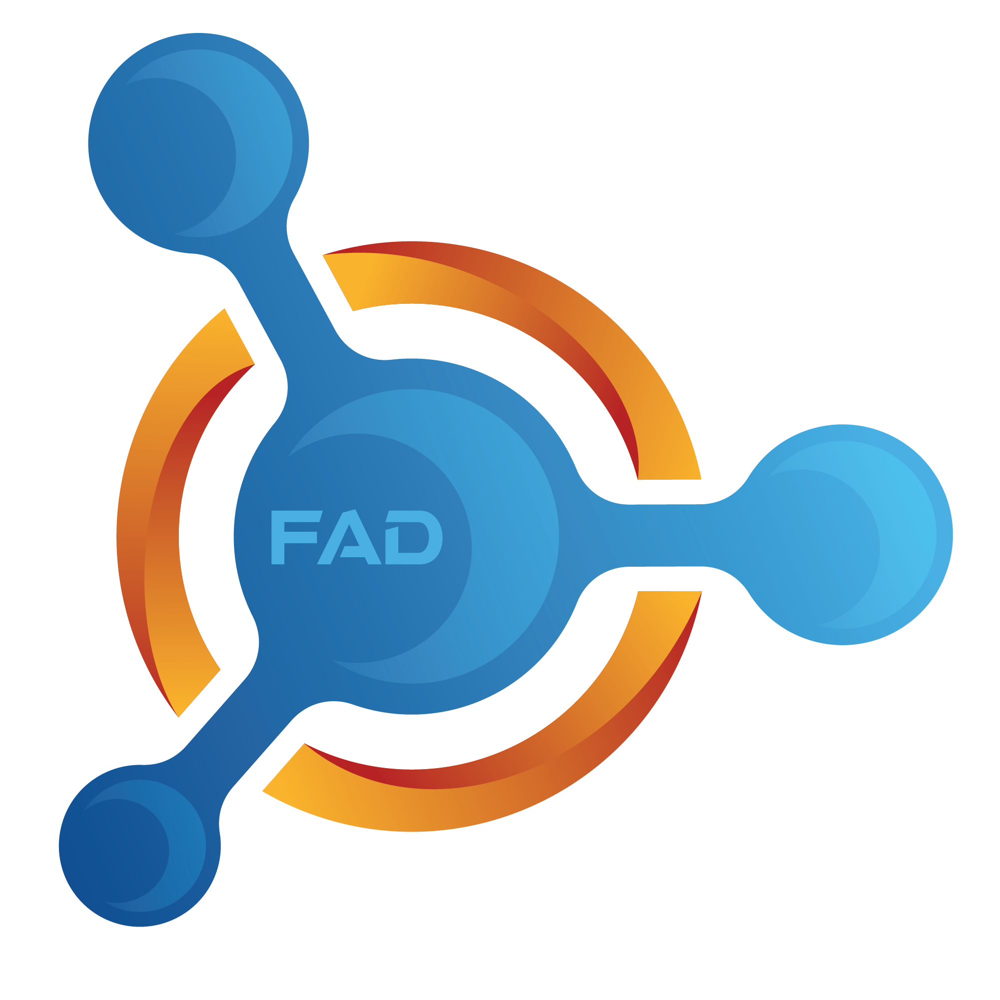

# 

Token TRC20 utility to be distributed among the world.

- Name: FADCOIN
- Symbol: FAD
- Decimal places: 8
- Total supply: Dynamic as tokens are distributed
- [Token link on the mainnet network](https://tronscan.org/#/token20/TXtByunizigmQvPhQiogZxVRaYixLLheH3)

### Overview

The FADCOIN Token will be created in order to be distributed to the world. In other words, all those who collaborate should receive their tokens for each approved activity.

### How to purchase and view

- You can acquire FADCOIN token by performing the activities that are in the available country.

[Access our website and click on I want to participate.](https://fadcoin.id/)
Questions or Suggestions?

Get in touch and let's talk.
